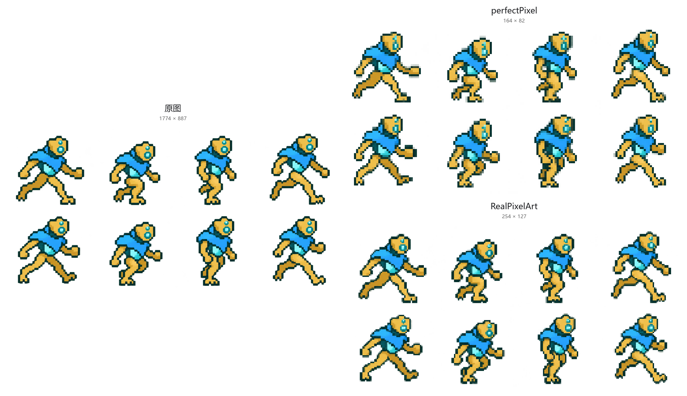

# RealPixelArt

[中文](README.md) | **English**


## Introduction

Restore AI-generated “pseudo pixel art” to low-resolution PNGs with a regular pixel grid. RealPixelArt can also pixelate ordinary photos and illustrations. It supports transparent backgrounds and processes images locally on your device.

**[Open the web app](https://realpixelart.github.io/)** · **[Download the desktop app](https://github.com/Bocchi-The-Glock/Real-PixelArt/releases)**


Left: original. Right: restored result. Both are displayed at the same size; the result is only **125×93** pixels.

## Download and installation

The web app runs directly in your browser. Download the desktop app from **Assets** on the [Releases page](https://github.com/Bocchi-The-Glock/Real-PixelArt/releases). No Python installation is required.

| System | Download | How to open |
| --- | --- | --- |
| Windows 64-bit | `RealPixelArt-<version>-win-x64.exe` | Double-click to run; no installation needed |
| Mac with Apple silicon (M series) | `RealPixelArt-<version>-mac-arm64.dmg` | Open and drag the app into Applications |
| Mac with an Intel processor | `RealPixelArt-<version>-mac-x64.dmg` | Open and drag the app into Applications |


The lightweight edition uses the system WebView: Windows prompts to install missing WebView2; Mac requires macOS 13.3+. The original edition is retained as **RealPixelArt Electron**. Image processing works offline. See the [desktop guide](desktop/README.md).

## Usage

### Web and desktop apps

**[Open the web app](https://realpixelart.github.io/)** · **[Download the desktop app](https://github.com/Bocchi-The-Glock/Real-PixelArt/releases)**

1. **Load an image**: click the upload button or the original-image panel, or drag a file into the panel.
2. **Generate the result**: start with the default settings. The app automatically detects the grid spacing and restores the pixels.
3. **Adjust colors if needed**: colors are unlimited by default. You can limit the color count or choose a palette. Color adjustments happen after restoration and do not change the recovered grid.
4. **Download the PNG**: leave the export scale at its default of **1** to save the native low-resolution image. Choose **2–16** for nearest-neighbor enlargement, without regenerating the result.

To specify the resolution, enable **Fixed size** below local grid adjustment, enter **X (width) × Y (height)**, and generate again. The algorithm fixes the number of columns and rows, adjusts cuts toward source edges, and uses the existing cell sampler. It does not resize an automatically generated result. Turning local adjustment off keeps global phase fitting only.

Fixed mode covers the entire source and overrides spacing search and square-grid options. A different aspect ratio changes the output proportions without cropping. Each axis must be 1–4096 and no larger than the corresponding source dimension, with at most one million output pixels. Use export scale for enlargement. This is a user-constrained grid, not proof of a unique original grid.

**No semi-transparent pixels** is an optional color-processing setting, disabled by default. Pixels below 75% opacity (alpha < 192) become fully transparent; the rest become opaque, retaining their RGB colors and grid positions. Toggle it after generation; turning it off restores the original recovered alpha. Use `--no-semitransparent` in the Python CLI, or `Config(no_semitransparent=True)` / `process_colors(image, no_semitransparent=True)` in the API.


### Python command line

Install Python 3.10 or later, download the source code, and run these commands from the project root:

```bash
python -m pip install -e .
python realpixelart.py -i input/lastTour.png
```

The result is saved to `output/lastTour.png`. By default, only the output image is generated.

```bash
python realpixelart.py -i input/lastTour.png --colors 32 --scale 4 --debug
```

This example limits the result to at most 32 colors and enlarges it by a factor of 4. Use `--help` to see all options. The algorithm's only runtime dependencies are NumPy and Pillow.

For a fixed output size, use `python realpixelart.py -i input/lastTour.png --target-size 128x96`, or `pixelize(image, Config(target_size=(128, 96)))` in Python. Omitting it retains automatic detection.

## Algorithm

Processing has four steps. The web and desktop apps use native JavaScript. The Python API remains available, with shared grid and pixel regression cases checking both implementations:

1. Measure color and alpha changes along both axes. Hidden RGB values in fully transparent pixels do not contribute to color decisions.
2. Generate candidate grids from FFT periodicity and edge spacing. Compare half and double spacings, search for the grid origin, and apply small local corrections. FFT does not determine the final spacing on its own.
3. Check whether edges align with grid lines. For some weaker candidates, use continuous horizontal and vertical edge segments as additional evidence, while protecting existing native single-pixel details.
4. Recover each cell's color with robust sampling that favors the center, checks neighboring samples for outliers, and preserves alpha. Color reduction and palette matching run separately afterward.


These images show the actual processing of bocchi2. Left: FFT spectrum. Middle: red and green indicate edges along the X and Y axes, respectively. Right: a close-up of the final cell boundaries in red.

When no reliable grid is found, the app attempts to estimate the spacing or pixelates at a conservative resolution. It tries to preserve existing native pixel art. Severe blur, repetitive textures, and irregular cells can still lead to incorrect detection. The confidence score shown in the interface is a heuristic, not a probability of correctness.

------

Thanks to [theamusing/perfectPixel](https://github.com/theamusing/perfectPixel). Its approach of estimating grid spacing with FFT, refining the grid using edges, and then sampling colors inspired this project.

RealPixelArt focuses on improvements in these areas:

- **Grid spacing**: compare multiple scales and origins, and validate candidates using edge spacing and continuous edge segments to reduce harmonic errors and excessive downsampling.
- **Detail and transparency**: protect native pixels, use center-first outlier checks, and account for alpha during edge detection and color sampling.
- **Color post-processing**: separate color reduction and palette matching from grid restoration, so color adjustments preserve the recovered grid.




From left to right: **original (1536×1024) → perfectPixel (168×111) → RealPixelArt (331×219)**. The bottom row shows matching areas of the character. All images use a white background and are displayed at the same size; low-resolution results are enlarged with nearest-neighbor scaling.

In this example, RealPixelArt preserves more detail around the eyes, hair, and hat brim, while perfectPixel produces a coarser result. The different output resolutions also contribute to this difference. This is a visual comparison of three existing images, not evidence that RealPixelArt performs better on every input.

See the [evaluation notes](EVALUATION.md) (in Chinese) for more measured results.

For development, see the [contribution guide and code structure](docs/CONTRIBUTING.md).
